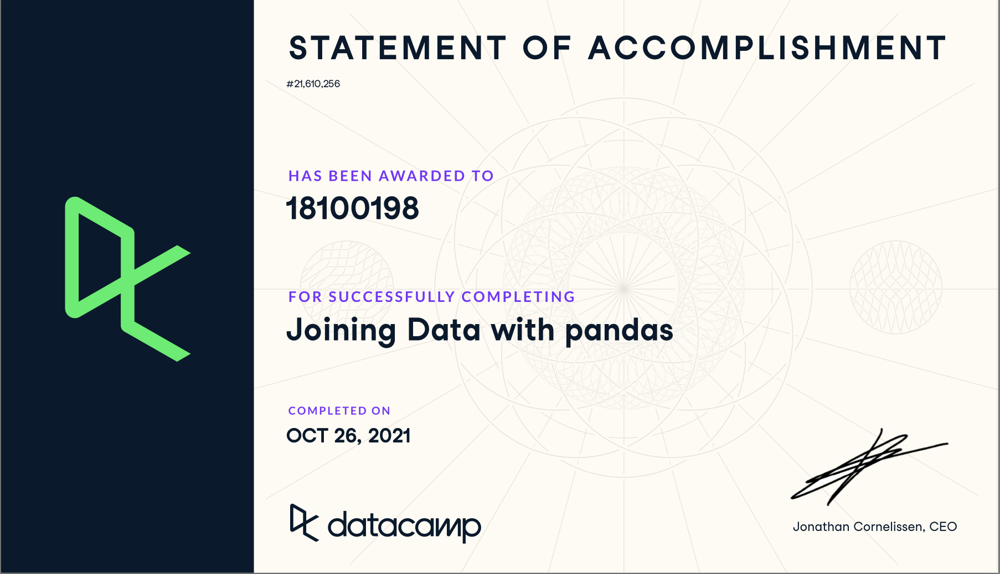
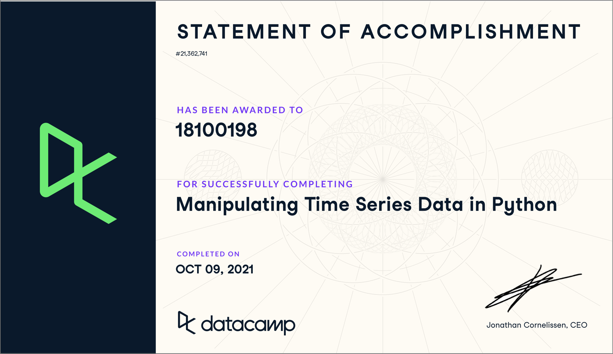
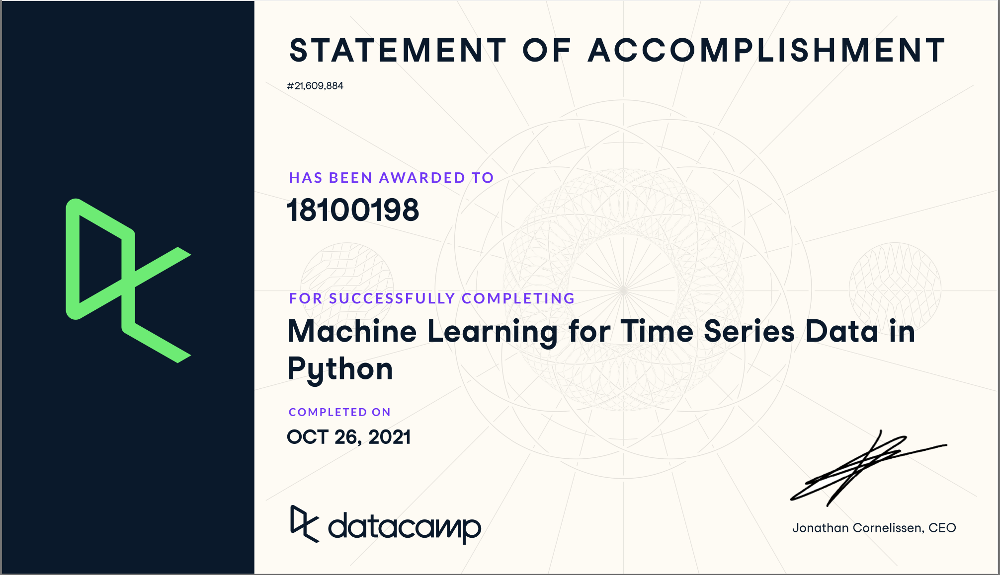
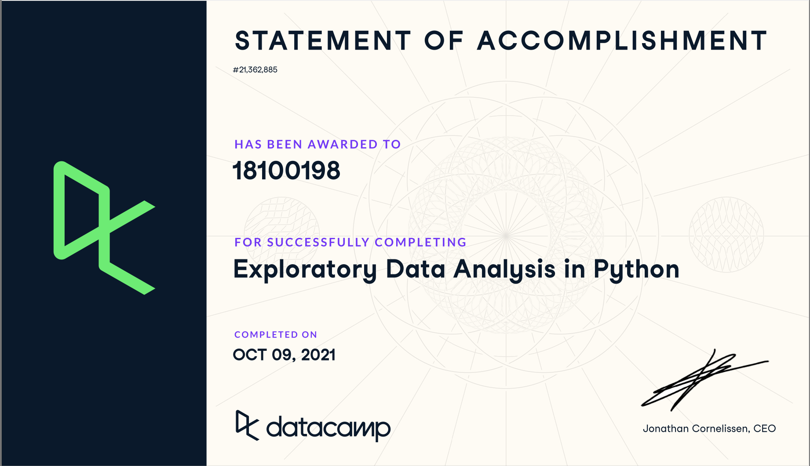
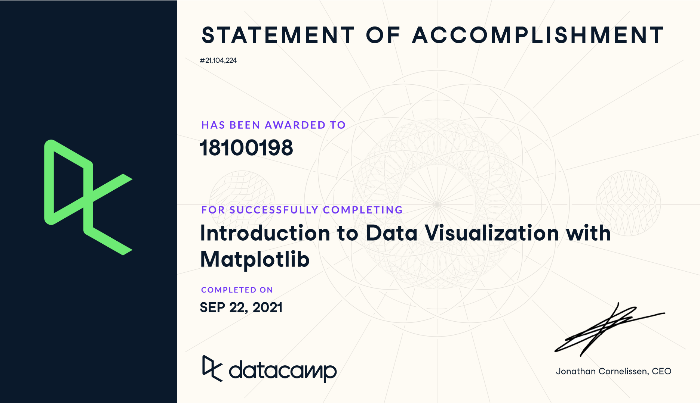
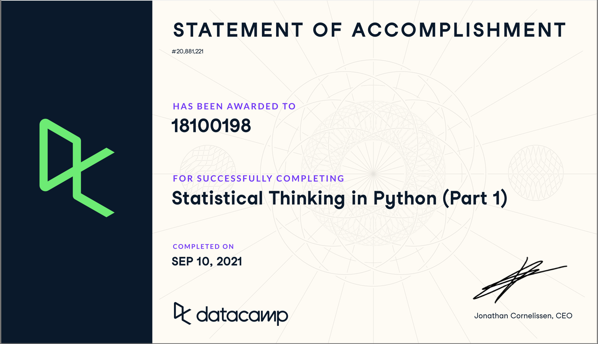
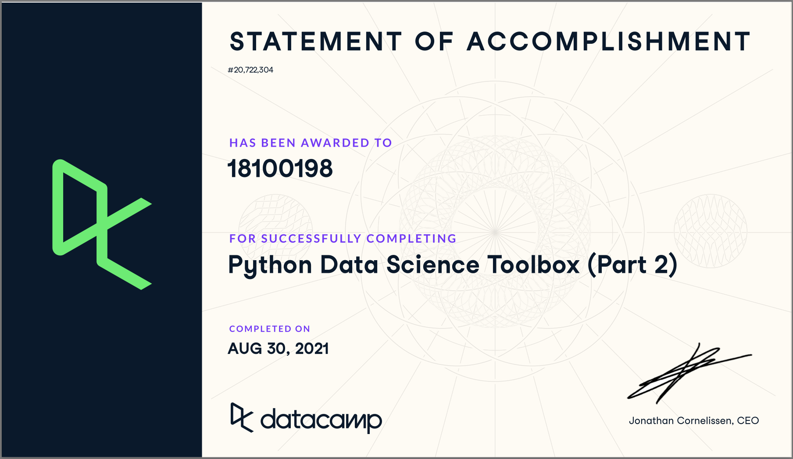
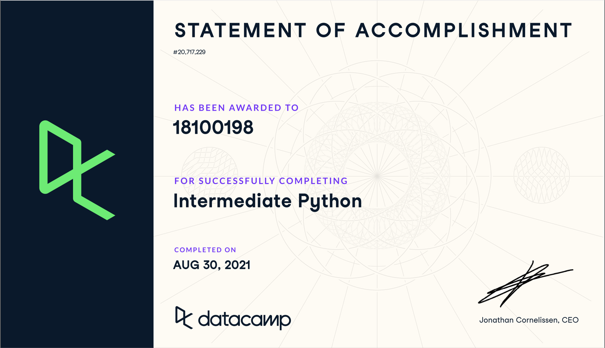
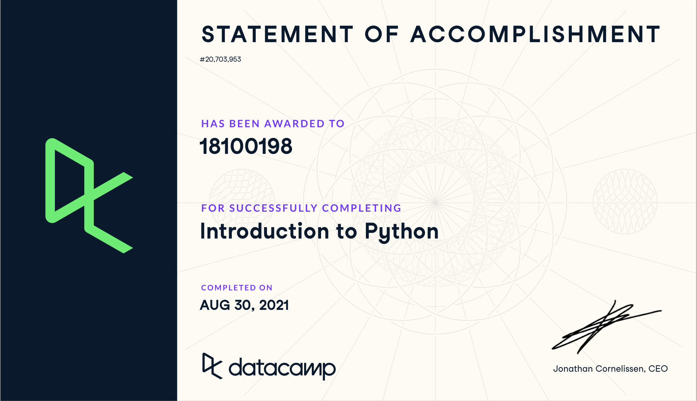
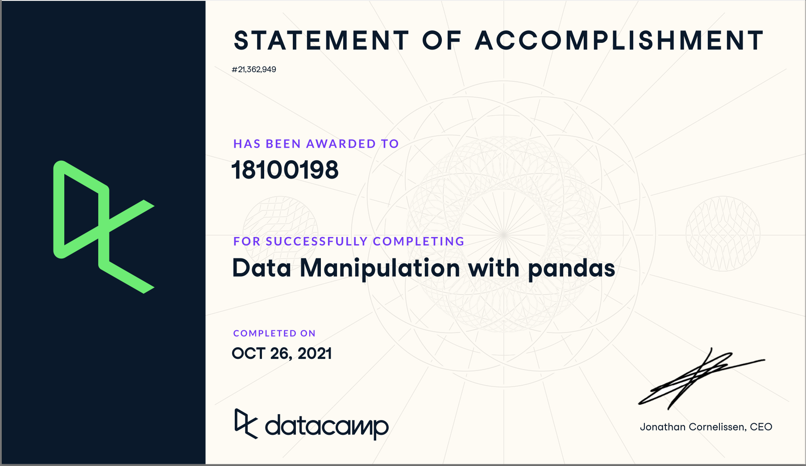

# ADS Portfolio - Koen de Bruijn (18100198)

**Naam:** Koen de Bruijn\
**Studentnummer:** 18100198\
**Course:** Applied Data Science

## Inhoud

1.  [Introductie](#introductie)
2.  [Datacamp courses](#datacamp-courses)
3.  [Reflection on own contribution](#reflection-on-own-contribution)
4.  [Reflection on own learning objectives](#reflection-on-own-learning-objectives)
5.  [Evaluation on the group project](#Evaluation-on-the-group-project)
6.  [Research project](#Research-project)
7.  [Domain knowledge](#Domain-knowledge)
8.  [Data preprocessing](#Data-preprocessing)
9.  [Communication](#Communication)

## Introductie

In dit portfolio lees je over mijn deelnamen aan de minor Applied Data Science als student ICT Software Engineering.

## Datacamp courses

Ik heb alle nodige Datacamp courses voltooit. Ik had al een beetje Python voorkennis, maar ik heb besloten om alle courses te maken. Dit heb ik gedaan, omdat ik alleen nog maar basis kennis had over Python en ik wist niets over alle library's die gebruikt worden in data science. Ik heb geen moeilijkheden ondervonden bij het maken van de courses

<details>
<summary>Open om alle <i>Statements of Accomplishments</i> te zien</summary>


















</details>

## Reflection on own contribution

**Situation**\
Voor deze minor heb ik deel genomen aan het Smart Teddy project. Ik had voordat ik deelnam aan deze minor geen kennis over data science of artificial intelligence. Voor dit project was het de bedoeling om emotie te classificeren vanuit audio. Voor dit project werkte ik met 5 andere studenten samen.

**Taak**\
De eerste periode van deze minor ben ik vooral bezig geweest met audio. Ik heb gekeken op welke manieren je audio kan visualizeren en welke _features_ je kunt extracten uit audio. Ik vond deze taak heel interresant omdat ik hiervoor nog niet wist wat voor data je allemaal kunt krijgen en weergeven vanuit een audio bestand. Zie hier de [notebook](notebooks/visualizing_audio.ipynb) & [story](https://github.com/koendebruijn/Emotions/issues/20).

Daarna heeft iedereen zelf een machine learning model toegepast voor ons project. Dit was namelijk een vereiste van de minor. Wij hadden het idee om allemaal een verschillend model toe te passen op ons project om vervolgens te vergelijken welke het best presteert op onze data. Ik heb gekozen om een _Support Vector Machine (SVM)_ toe te passen. Ik heb voor dit model gekozen, omdat deze een aantal keer naar voren is gekomen in het vooronderzoek voor dit project. Zie hier de bijbehorende [notebook](notebooks/svm.ipynb) & [story](https://github.com/koendebruijn/Emotions/issues/29).

Tijdens het voor onderzoek kwamen we erachter dat veel andere onderzoekers gebruik maakte van augmentation. Wij hebben dit ook toegepast door het maken van een de _Augemter class_. Deze class zou het simpeler moeten maken om je audio te augmenteren en voorkomt gedupliceerde code. [notebook](notebooks/augmentatuib.ipynb) & [story](https://github.com/koendebruijn/Emotions/issues/39).

Als laatste heb ik samen met Julian gewerkt aan het prototype. Dit prototype is gemaakt voor de mensen die veder gaan met de applicatie voor de Smart Teddy. Het prototype geeft een op een hele simpele manier weer hoe je het model kunt gebruiken in de echte applicatie. Ook was het voor ons als groep leuk om te zien hoe het model werkt in een echte (wel hele simpele) applicatie. [prototype code](https://github.com/koendebruijn/Emotions/tree/main/prototype) & [story](https://github.com/koendebruijn/Emotions/issues/72)

Natuurlijk heb ik nog meer dingen uitgevoerd naast de bovenstaande taken, maar dit vond ik persoonlijk zelf een paar van de leukste. [scrum board](https://github.com/koendebruijn/Emotions/projects/1)

**Actie**\
Wanneer ik tegen problemen opliep was Google vaak mijn eerste hulpmiddel. De kans is namelijk al heel groot dat iemand voor mij dit probleem al heeft gehad. Zo kan ik gemakkelijk de oplossing vinden en deze toepassen op ons project. Als een project lid veel kennis had over een onderwerp dan stelde ik deze persoon vaak de vraag tijdens of na de daily standup of ik stuurde een bericht in ons communicatie kanaal.

**Resultaat**\
Ik ben erg tevreden met alle resultaten die ik heb gemaakt tijdens het project. Ik denk dat iedereen een gelijke bijdragen heeft geleverd aan het project. Dit is ook te zien aan het aantal taken dat bij iedereen is toegewezen. In eerste instantie leek het prototype niet te werken, maar na veel debuggen bleek het een probleem te zijn met mijn M1 (ARM) processor en werkte het gelukkig wel op de x86 architectuur.

**Reflectie**\
Ik vind dat ik deze minor best goed heb gedaan. Ik ben begonnen met nul kennis van data science en we zijn als groep geeindigd met een werkend Convolutial Neural Network (CNN) dat emoties kan classificeren. Ik zelf ben dan ook uitersterd te vreden over de resulaten die zowel ik als de rest van mijn groep hebben geboekt. Het punt dat mij het meest is bijgestaan is _Garbage in Garbage out_. Ik heb dit ook zelf mee gemaakt nadat de resultaten van de CNN aanzienlijk zijn verhoogd na het uitvoeren van data cleaning. Wat ik tijdens deze minor heb geleerd ga ik ook zeker toepassen in mijn latere projecten als software engineer.

## Reflection on own learning objectives

> The student reflected in a sufficient way to his own learning objectives. The reflection contains at least 400 words and a reflection method (like STARR) was used.

**Situatie**\
**Taak**\
**Actie**\
**Resultaat**\
**Reflectie**\

## Evaluation on the group project

**Situatie**\
Voor dit project maakte ik deel uit van een team van 5 andere studenten. 3 van deze studenten waren ook software engineer net als ik. De andere studenten studeerde bedrijfskunde en bestuurskunde. Ik vond het persoonlijk erg fijn dat we een mix van verschillende opleidingen haddden in ons project groep. Dit zorgde in sommige gevallen op andere perspectiven op een probleem

**Taak**\
Voor ons project werkte wij met scrum en gebruikte GitHub als scrumboard. Wij hadden elke ochtend een daily standup waarin wij onze voortgang en eventuelen problemen vertelden aan de andere groepsleden. Wij hadden afgesproken om tijdens een minor een mix van fysiek en thuis werk te hanteren. Iedereen had ook eigen taken. Zo was iemand verantwoordelijk voor het maken van de notities tijdens de meetings met de begeleiders of de scrummaster / productowner die in GitHub elke keer nieuwe taken stories aanmaakt. Wij hanteerde sprints van 2 weken met op de helft van de sprint een refinement en op het einde een retrospective.

**Actie**\
Tijdens het project hebben wij op verschillende manieren gewerkt. Het hing vaak een beetje af van het moment in het project waar wij ons bevonden. Op sommige momenten konden wij heel goed parallel werken. Iedereen had zijn eigen taken en kon deze zelfstandig oplossen. Andere momenten ging dit minder goed, omdat er bijvoorbeeld een taak af moest zijn voordat de andere taak kon beginnen. Dit zorgde af en toe voor een soort bottlenecks.

**Resultaat**\
Ik ben erg tevreden hoe wij als groep dit project hebben afgerond. Iedereen was het gehele project erg gemotiveerd en positief over onze geboekte resultaten. Een van de docenten benoemde tijdens een meeting dat je altijd ergens tijdens het project de moed kan verliezen door bijvoorbeeld slechte resultaten of weinig vooruitgang. Zo zat er bijvoorbeeld een foutje in het preprocessen van de audio. Dit leidde tot een extreem hoge accuracy, maar dit was helaas niet representatief door verkeerde input data. Wij zijn als team heel goed door dit moment heengekomen en waren vast beraden om dit resultaat alsnog te behalen.

**Reflectie**\
Zoals eerder benoemd is de samenwerking in dit groepje mij erg goed bevallen en heb ik eigenlijk geen negative punten te noemen over het team of de samenwerking. Tijdens de retrospective bespraken we ook de aandachtspunten binnen het team en bedachten we een oplossing zodat dit niet nog eens zou gebeuren. Ik heb nog wel een aandachts puntje voor mijzelf in volgende projecten. Ik merkte dat ik iets te vaak door mijn wekken ben heen geslapen en ga hier voor een volgend project zeker extra aandacht aanbesteden dat dit niet nog vaker gebeurd.

## Research project

### Task definition

> The student has clearly described the context (reason and problem definition) and research questions that are reasonable given the context.

### Evaluation

> The student has given several clear and motivated directions for future work.

### Conclusions

> The student has discussed the results, illustrated by examples (qualitative analysis)and answers the original research questions based on the findings in this study and has tested the outcomes for statistical significance.

### Planning

> The student has planned the research project in a good, agile (Scrum) and efficient way.

## Predictive Analytics

### Selecting a model

> The student has supported their model selection with references from literature

Voor het project heb ik een SVM machine learning model gemaakt. Ik heb dit model gekozen, omdat ik tijdens het literatuur onderzoek [dit](https://www.sciencedirect.com/science/article/pii/S1746809420300501) onderzoek heb gevonden. In dit onderzoek word een SVM gebruikt voor het classifiseren van emotie op de RAVDESS dataset.

### Configuring a Model

The student explains why the chosen configuration is reasonable (for instance using relevant literature)

>

### Training a model

> The student takes appropriate countermeasures to prevent under- and overfitting and tunes hyperparameters

### Evaluating a model

> The student compares several models and additionally explains the differences between the models.

### Visualizing the outcome of a model (explanatory)

> The student has visualized the results both quantatively in a plot and where applicable qualitatively using examples.

## Domain knowledge

### Introduction of the subject field

> The student has written a good and complete introduction of the subject field.

### Literature research

> The student has found enough relevant literature and all in-text literature references and bibliography are present.

### Explanation of Terminology, jargon and definitions

> The student explained all important and all relevant terminology, jargon and definitions.

## Data preprocessing

### Data exploration

> The student properly examined and visualized the data, distributions, outliers, correlations and used that analysis to give directions for an early hypothesis.

### Data cleansing

> The student cleansed the data in a good and sufficient way.

De audio bestanden uit onze dataset beginnen en eidigen vaak met een stuk silte. Wij hebben librosa gebruikt om deze stilte eraf te trimmen. Dit leide namelijk tot een betere presatie van de models.

<details>
<summary>Open voor de code snippet voor het cleanen van de audio</summary>

```py
def _process_audio(value):
    x, sample_rate = librosa.load(value['file_path'], sr=44100)
    x, index = librosa.effects.trim(x, top_db=20)
    return x, sample_rate
```

</details>

### Data preparation

> The student prepared the data in an appropriate way, where necessary transforming data, removing outliers, filling in missing values, etc.

### Data explanation

> The student described the the entire dataset in a good and sufficient way.

### Data visualization (exploratory)

> The student correctly visualized the data in support of decisions made for learning the model

## Communication

### Presentations

> The student prepared or gave more than two (internal/external) solid presentations.

### Writing paper

> The student has made a lot of effort on writing the paper.
