# ADS Portfolio - Koen de Bruijn (18100198)

**Naam:** Koen de Bruijn\
**Studentnummer:** 18100198\
**Course:** Applied Data Science

## Inhoud

1.  [Introductie](#introductie)
2.  [Datacamp courses](#datacamp-courses)
3.  [Reflection on own contribution](#reflection-on-own-contribution)
4.  [Reflection on own learning objectives](#reflection-on-own-learning-objectives)
5.  [Evaluation on the group project](#Evaluation-on-the-group-project)
6.  [Research project](#Research-project)
7.  [Domain knowledge](#Domain-knowledge)
8.  [Data preprocessing](#Data-preprocessing)
9.  [Communication](#Communication)

## Introductie

In dit portfolio lees je over mijn deelnamen aan de minor Applied Data Science als student ICT Software Engineering.

## Datacamp courses

Ik heb alle nodige Datacamp courses voltooit. Ik had al een beetje Python voorkennis, maar ik heb besloten om alle courses te maken. Dit heb ik gedaan, omdat ik alleen nog maar basis kennis had over Python en ik wist niets over alle library's die gebruikt worden in data science. Ik heb geen moeilijkheden ondervonden bij het maken van de courses

<details>
<summary>Open om alle <i>Statements of Accomplishments</i> te zien</summary>


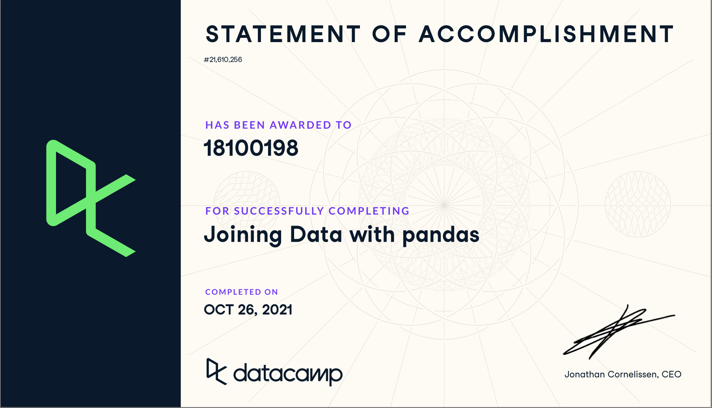
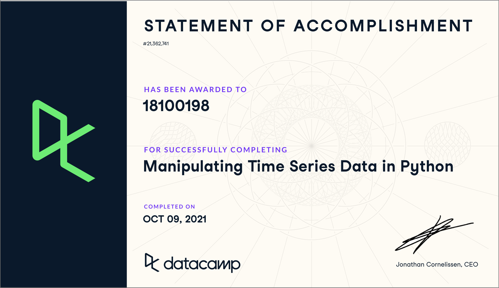
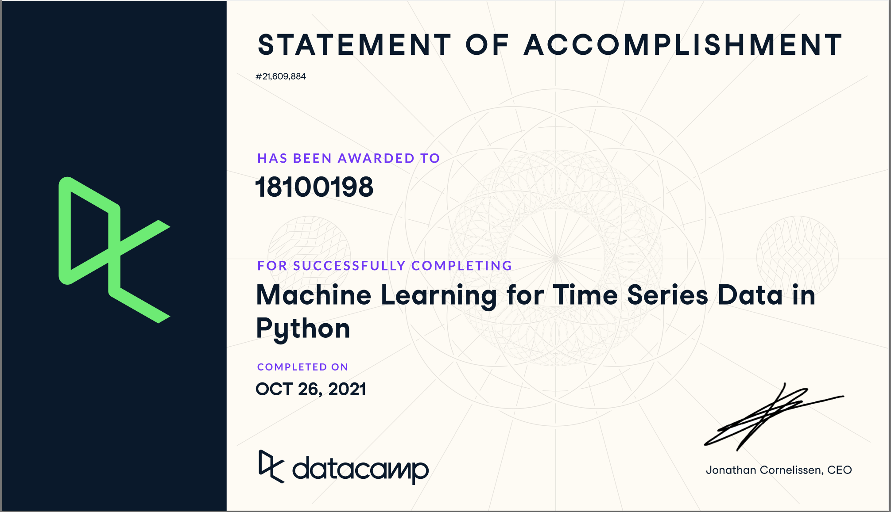
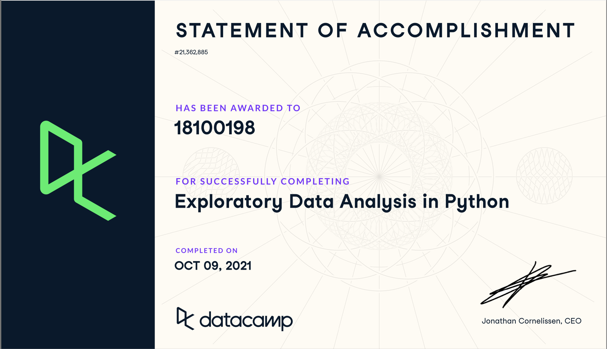

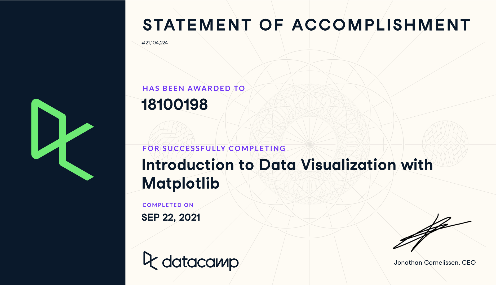
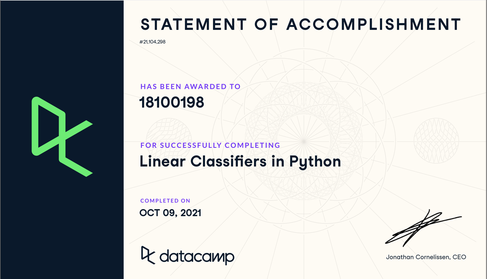

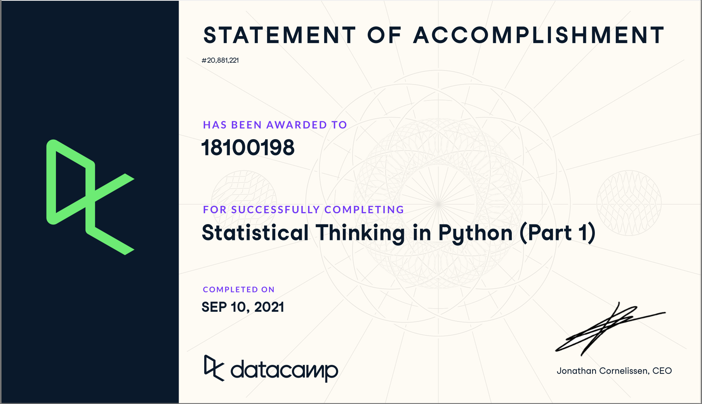
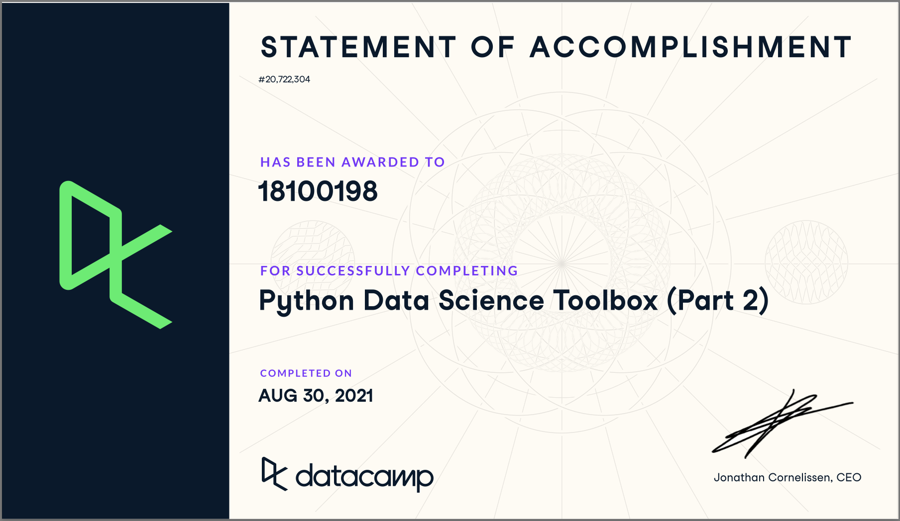

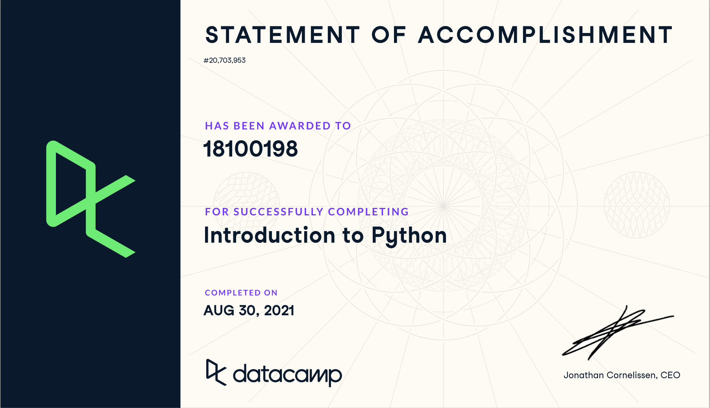
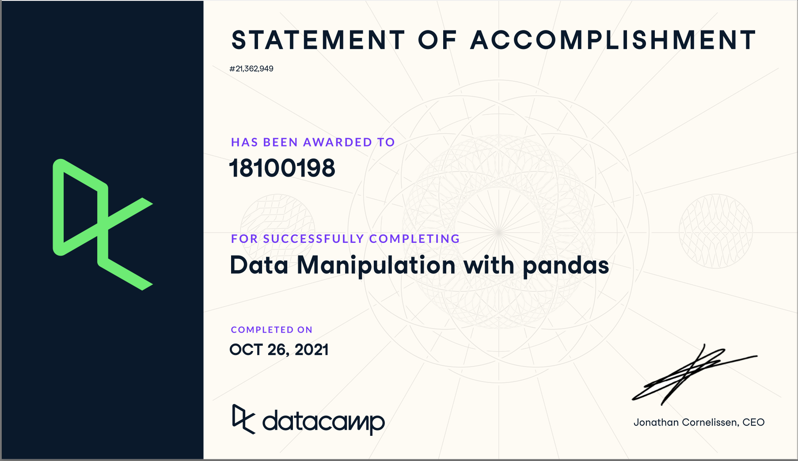


</details>

## Reflection on own contribution

**Situatie**\
Voor deze minor heb ik deel genomen aan het Smart Teddy project. Ik had voordat ik deelnam aan deze minor geen kennis over data science of artificial intelligence. Voor dit project was het de bedoeling om emotie te classificeren vanuit audio. Voor dit project werkte ik met 5 andere studenten samen.

**Taak**\
De eerste periode van deze minor ben ik vooral bezig geweest met audio. Ik heb gekeken op welke manieren je audio kan visualiseren en welke _features_ je kunt extracten uit audio. Ik vond deze taak heel interessant omdat ik hiervoor nog niet wist wat voor data je allemaal kunt krijgen en weergeven vanuit een audiobestand. Zie hier de [notebook](assets/notebooks/visualizing_audio.ipynb) & [story](https://github.com/koendebruijn/Emotions/issues/20).

Daarna heeft iedereen zelf een machine learning model toegepast voor ons project. Dit was namelijk een vereiste van de minor. Wij hadden het idee om allemaal een verschillend model toe te passen op ons project om vervolgens te vergelijken welke het best presteert op onze data. Ik heb gekozen om een _Support Vector Machine (SVM)_ toe te passen. Ik heb voor dit model gekozen, omdat deze een aantal keren naar voren is gekomen in het vooronderzoek voor dit project. Zie hier de bijbehorende [notebook](assets/notebooks/svm.ipynb) & [story](https://github.com/koendebruijn/Emotions/issues/29).

Tijdens het voor onderzoek kwamen we erachter dat veel andere onderzoekers gebruik maakte van augmentation. Wij hebben dit ook toegepast door het maken van een de _Augemter class_. Deze class zou het simpeler moeten maken om je audio te augmenteren en voorkomt gedupliceerde code. [notebook](assets/notebooks/augmentation.ipynb) & [story](https://github.com/koendebruijn/Emotions/issues/39).

Als laatste heb ik samen met Julian gewerkt aan het prototype. Dit prototype is gemaakt voor de mensen die veder gaan met de applicatie voor de Smart Teddy. Het prototype geeft op een hele simpele manier weer hoe je het model kunt gebruiken in de echte applicatie. Ook was het voor ons als groep leuk om te zien hoe het model werkt in een echte (wel hele simpele) applicatie. [prototype code](https://github.com/koendebruijn/Emotions/tree/main/prototype) & [story](https://github.com/koendebruijn/Emotions/issues/72)

Natuurlijk heb ik nog meer dingen uitgevoerd naast de bovenstaande taken, maar dit vond ik persoonlijk zelf een paar van de leukste. [scrum board](https://github.com/koendebruijn/Emotions/projects/1)

**Actie**\
Wanneer ik tegen problemen opliep was Google vaak mijn eerste hulpmiddel. De kans is namelijk al heel groot dat iemand voor mij dit probleem al heeft gehad. Zo kan ik gemakkelijk de oplossing vinden en deze toepassen op ons project. Als een project lid veel kennis had over een onderwerp dan stelde ik deze persoon vaak de vraag tijdens of na de daily standup of ik stuurde een bericht in ons communicatie kanaal.

**Resultaat**\
Ik ben erg tevreden met alle resultaten die ik heb gemaakt tijdens het project. Ik denk dat iedereen een gelijke bijdragen heeft geleverd aan het project. Dit is ook te zien aan het aantal taken dat bij iedereen is toegewezen. In eerste instantie leek het prototype niet te werken, maar na veel debuggen bleek het een probleem te zijn met mijn M1 (ARM) processor en werkte het gelukkig wel op de x86 architectuur.

**Reflectie**\
Ik vind dat ik deze minor best goed heb gedaan. Ik ben begonnen met nul kennis van data science en we zijn als groep geëindigd met een werkend Convolutial Neural Network (CNN) dat emoties kan classificeren. Ik zelf ben dan ook erg tevreden over de resultaten die zowel ik als de rest van mijn groep hebben geboekt. Het punt dat mij het meest is bijgestaan is _Garbage in Garbage out_. Ik heb dit ook zelf mee gemaakt nadat de resultaten van de CNN aanzienlijk zijn verhoogd na het uitvoeren van data cleaning. Wat ik tijdens deze minor heb geleerd ga ik ook zeker toepassen in mijn latere projecten als software engineer.

## Reflection on own learning objectives

**Situatie**\
Ik heb deze minor gekozen, omdat data science en artificial intelligence momenteel een erg hot ding is in de wereld van software-engineering. Er is bijna geen applicatie meer te vinden waar geen artificial intelligence in gebruikt word. Zoals al eerder benoemd had ik vrij weinig kennis op het gebied van data science. Ik had daarom geen leer doelen voor mijzelf opgesteld, maar ben ik uitgegaan van de _General Objectives_ die staan beschreven bij de Osiris cursus.

**Taak**\
Na de eerste paar lessen had ik een beter beeld van mijn leerdoelen. Deze waren als volgt:

1. Goed overweg kunnen met de data science Python libraries (numpy, matplotlib, pandas, librosa).
2. Leren werken met machine learning modellen
3. Ik wil goed leren visualiseren zodat ik kan zien hoe mijn data eruit zien.
4. Beter worden in het schrijven van een onderzoek
5. (Convolutial) Neural Networks toepassen op verschillende datasets

**Actie**\
Om mijn leerdoelen te halen heb ik naast de colleges ook zelf geleerd via andere kanalen. Ik vind het persoonlijk erg fijn om hetzelfde onderwerp door verschillende manieren uitgelegd te krijgen. Omdat niet iedereen een onderwerp hetzelfde uitlegt, leer ik het onderwerp vanuit verschillende perspectieven en zie ik de overeenkomsten en verschillen van methodes gebruikt bij de leraren.

**Resultaat**\
Om mijn leerdoelen te halen heb ik verschillende stappen ondernomen.

1. Om dit leerdoel te behalen heb ik de DataCamp courses behaald. Deze courses gingen in op alle library's die veel gebruikt worden in datascience. Helaas was er geen course over librosa dus om deze library te leren heb ik video's op youtube gezocht en bekeken.
2. Voor het leren van de machine learning models waren de colleges erg nuttig. Hierin werden een aantal modellen besproken en uitgelegd. Veder gingen een aantal van de DataCamp courses ook over machine learnign modellen. Ook heeft het youtube kanaal [Tech With Tim](https://www.youtube.com/c/TechWithTim) heeft mij ook erg geholpen. Hij behandeeld veer onderwerpen die te maken hebben met Python.
3. Hetzelfde geld voor data visualisatie. De DataCamp courses waren erg behulpzaam in het leren van dit onderwerp. Ook heeft de les over visualisatie erg geholpen. Uiteindelijk heb ik dit het beste geleerd door gewoon te doen. Ik heb op Kaggle datasets gezocht en heb deze op verschillende manieren geprobeerd te visualiseren.
4. Er stonden op BlackBoard een aantal slides over het schrijven van een paper. Deze heb ik allemaal goed doorgenomen. Veder heb ik op YouTube een aantal filmpjes gekeken over het schrijven van een paper. Net als het vorige leerdoel heb ik dit ook geleerd door het gewoon te gaan doen.
5. Helaas vind ik dat ik dit leerdoel niet voldoende heb gehaald. Voor dit leerdoel heb ik alleen de lessen gevolgd en een [YouTube course](https://www.youtube.com/watch?v=c36lUUr864M) gevolgd. Ik ben helaas niet toegekomen aan het toepassen van (C)NN's op verschillende datasets.

**Reflectie**\
Ik heb tijdens deze minor heel veel nieuwe dingen geleerd waar ik later veel aan ga hebben. Ik zowel geleerd over welke verschillende machine learning modellen met allerlei verschillende toepassingen. Ik heb veel geleerd over het doen van een onderzoek en het uitwerken hiervan. Ook ben ik beter geworden in het lezen van grafieken en het weergeven van data op verschillende manieren. Helaas ben ik niet toegekomen aan het toepassen van een (C)NN. Wel heb ik alle slides vanuit de lessen opgeslagen en ga ik hier zeker nog mee aan de slag na deze minor.

## Evaluation on the group project

**Situatie**\
Voor dit project maakte ik deel uit van een team van 5 andere studenten. 3 van deze studenten waren ook software engineer net als ik. De andere studenten studeerde bedrijfskunde en bestuurskunde. Ik vond het persoonlijk erg fijn dat we een mix van verschillende opleidingen hadden in ons project groep. Dit zorgde in sommige gevallen op andere perspectieven op een probleem

**Taak**\
Voor ons project werkte wij met scrum en gebruikte GitHub als scrumboard. Wij hadden elke ochtend een daily standup waarin wij onze voortgang en eventuele problemen vertelden aan de andere groepsleden. Wij hadden afgesproken om tijdens een minor een mix van fysiek en thuis werk te hanteren. Iedereen had ook eigen taken. Zo was iemand verantwoordelijk voor het maken van de notities tijdens de meetings met de begeleiders of de scrummaster / productowner die in GitHub elke keer nieuwe taken stories aanmaakt. Wij hanteerden sprints van 2 weken met op de helft van de sprint een refinement en op het einde een retrospective.

**Actie**\
Tijdens het project hebben wij op verschillende manieren gewerkt. Het hing vaak een beetje af van het moment in het project waar wij ons bevonden. Op sommige momenten konden wij heel goed parallel werken. Iedereen had zijn eigen taken en kon deze zelfstandig oplossen. Andere momenten ging dit minder goed, omdat er bijvoorbeeld een taak af moest zijn voordat de andere taak kon beginnen. Dit zorgde af en toe voor een soort bottlenecks.

**Resultaat**\
Ik ben erg tevreden hoe wij als groep dit project hebben afgerond. Iedereen was het gehele project erg gemotiveerd en positief over onze geboekte resultaten. Een van de docenten benoemde tijdens een meeting dat je altijd ergens tijdens het project de moed kan verliezen door bijvoorbeeld slechte resultaten of weinig vooruitgang. Zo zat er bijvoorbeeld een foutje in het preprocessen van de audio. Dit leidde tot een extreem hoge accuracy, maar dit was helaas niet representatief door verkeerde input data. Wij zijn als team heel goed door dit moment heen gekomen en waren vast beraden om dit resultaat alsnog te behalen.

**Reflectie**\
Zoals eerder benoemd is de samenwerking in dit groepje mij erg goed bevallen en heb ik eigenlijk geen negative punten te noemen over het team of de samenwerking. Tijdens de retrospective bespraken we ook de aandachtspunten binnen het team en bedachten we een oplossing zodat dit niet nog eens zou gebeuren. Ik heb nog wel een aandachtspuntje voor mijzelf in volgende projecten. Ik merkte dat ik iets te vaak door mijn wekken ben heen geslapen en ga hier voor een volgend project zeker extra aandacht aanbesteden dat dit niet nog vaker gebeurd.

## Research project

### Task definition

> The student has clearly described the context (reason and problem definition) and research questions that are reasonable given the context.

### Evaluation

> The student has given several clear and motivated directions for future work.

### Conclusions

> The student has discussed the results, illustrated by examples (qualitative analysis)and answers the original research questions based on the findings in this study and has tested the outcomes for statistical significance.

### Planning

Als scum omgeving hebben wij GitHub. Wij hebben de GitHub issues gebruikt als stories en de GitHub milestones als sprints. Op deze manier konden wij stories aan sprints toevoegen en deze vervolgens filteren op de sprint.

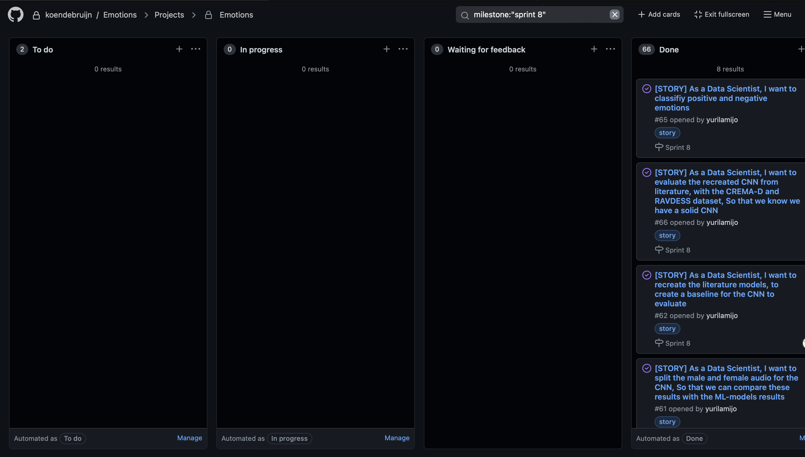

Hier zien je ons scrum board voor sprint 8 (onze laatste sprint). Wij hebben het verdeeld in 4 colommen To do, In progress, waiting for feedback en Done. Op deze manier konden wij tijdens de daily standup gemakkelijk zien waar wij precies stonden in de sprint en welke stories stil stonden, omdat wij bijvoorbeeld op feedback van een docent moesten wachten.

Wij hadden elke dag een daily standup waarin iedereen zijn voortgang deelde met de rest van het team. Ook gebruikte wij dit moment voor als iemand vast zat met een story en hulp nodig had om veder te gaan. Dan werd er met die persoon een moment gepland om er gezamelijk naar te kijken.

Eerst hanteerde wij sprints van 1 week. Na een aantal sprints kwamen we tijdens een retrospective tot de conclusie dat dit te kort is. Wij hebben daarna sprints van 2 weken aangehouden. Op de helft van de sprint hielden wij een refinement waarin we bespraken of alles nog haalbaar was of dat er misschien een paar nieuwe stories bij zouden kunnen komen.

Na elke spring hielden wij een retrospective. Hierin bespraken wij wat er goed ging, wat er minder goed ging en wat er verbeterd moet worden. Wij gebruikte een de tool [Fraankly](https://www.fraankly.com) voor onze retrospectives. Bij deze tool hadden we eerst de tijd om annoniem kaartjes aan te maken voor wat er allemaal goed en niet goed ging. De kaartjes waaren annoniem zodat jouw kaartjes niet beinvloed zouden worden door andere. Daarna moest iedereen zijn kaartjes bespreken en moest er gestemd worden op de kaartjes waar je het meest mee eens was. Op het einde van de retroscpective maakte wij een lijst met _actie punten_. Dit waren punten die wij volgende sprint aandacht aan moeten besteden. Hier maakte wij vervolgens ook stories van zodat deze volgende sprint opgepakt zouden worden.

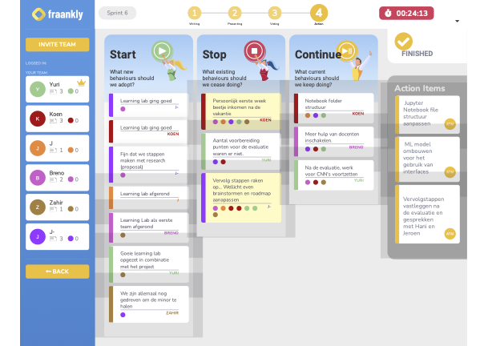

Wij hebben als groep ook een roadmap gemaakt. Dit vonden wij allemaal erg handig om tijdens de sprint planning naar te kijken. Op deze manier wisten wij of we op schema lagen volgens onze planning. Natuurlijk haalden we dit niet altijd of hadden we dingen verkeerd ingeschat op de roadmap. Dit hebben we dan direct aangepast.

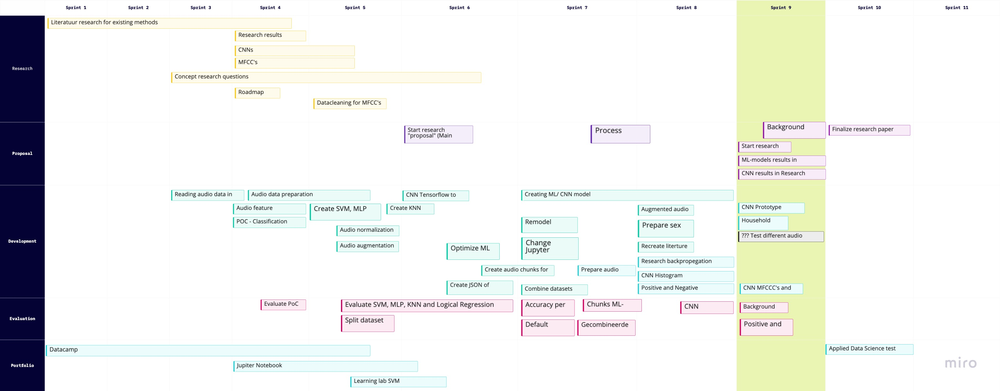

## Predictive Analytics

### Selecting a model

> The student has supported their model selection with references from literature

Voor het project heb ik een SVM machine learning model gemaakt. Ik heb dit model gekozen, omdat ik tijdens het literatuur onderzoek [dit](https://www.sciencedirect.com/science/article/pii/S1746809420300501) onderzoek heb gevonden. In dit onderzoek word een SVM gebruikt voor het classifiseren van emotie op de RAVDESS dataset.

### Configuring a Model

The student explains why the chosen configuration is reasonable (for instance using relevant literature)

>

### Training a model

> The student takes appropriate countermeasures to prevent under- and overfitting and tunes hyperparameters

### Evaluating a model

> The student compares several models and additionally explains the differences between the models.

### Visualizing the outcome of a model (explanatory)

> The student has visualized the results both quantatively in a plot and where applicable qualitatively using examples.

## Domain knowledge

### Introduction of the subject field

> The student has written a good and complete introduction of the subject field.

### Literature research

> The student has found enough relevant literature and all in-text literature references and bibliography are present.

### Explanation of Terminology, jargon and definitions

> The student explained all important and all relevant terminology, jargon and definitions.

## Data preprocessing

### Data exploration

> The student properly examined and visualized the data, distributions, outliers, correlations and used that analysis to give directions for an early hypothesis.

### Data cleansing

> The student cleansed the data in a good and sufficient way.

De audio bestanden uit onze dataset beginnen en eidigen vaak met een stuk silte. Wij hebben librosa gebruikt om deze stilte eraf te trimmen. Dit leide namelijk tot een betere presatie van de models.

<details>
<summary>Open voor de code snippet voor het cleanen van de audio</summary>

```py
def _process_audio(value):
    x, sample_rate = librosa.load(value['file_path'], sr=44100)
    x, index = librosa.effects.trim(x, top_db=20)
    return x, sample_rate
```

</details>

### Data preparation

> The student prepared the data in an appropriate way, where necessary transforming data, removing outliers, filling in missing values, etc.

### Data explanation

> The student described the the entire dataset in a good and sufficient way.

### Data visualization (exploratory)

> The student correctly visualized the data in support of decisions made for learning the model

## Communication

### Presentations

> The student prepared or gave more than two (internal/external) solid presentations.

### Writing paper

> The student has made a lot of effort on writing the paper.
